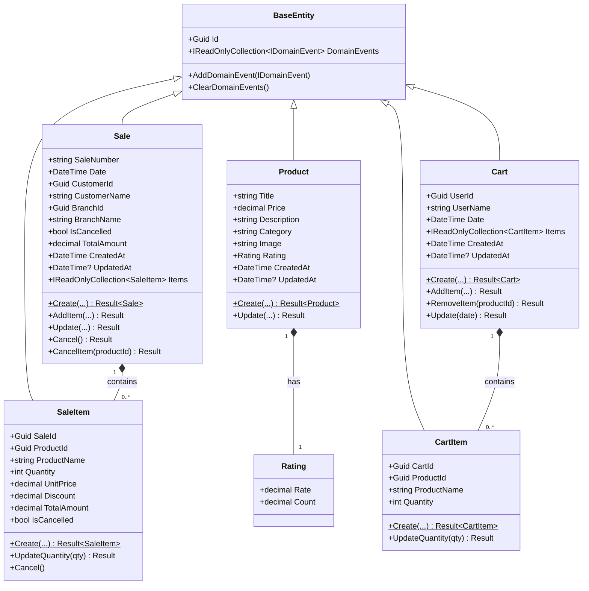
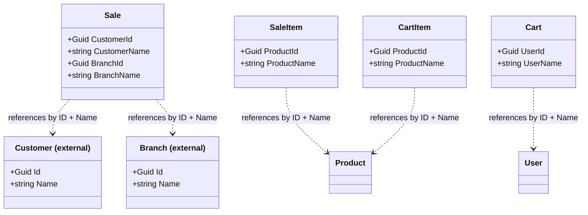
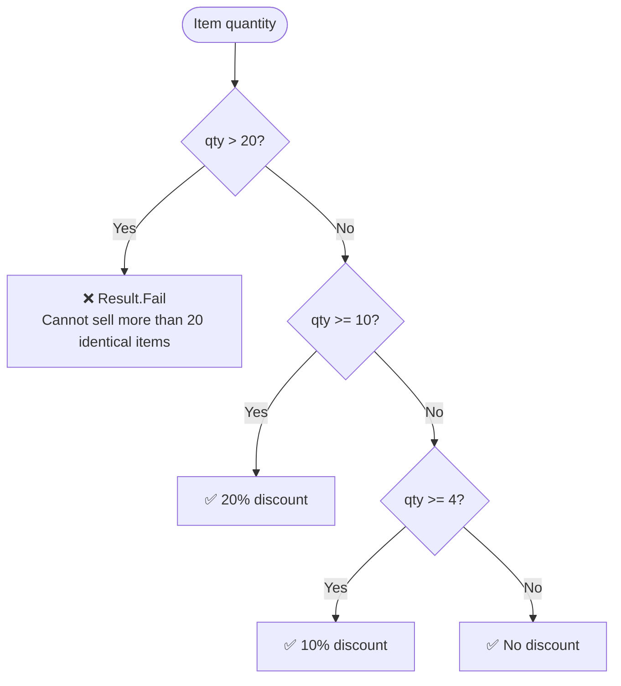
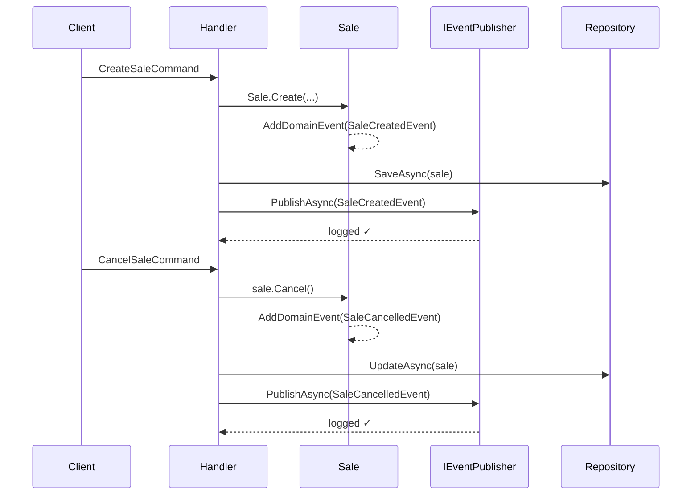
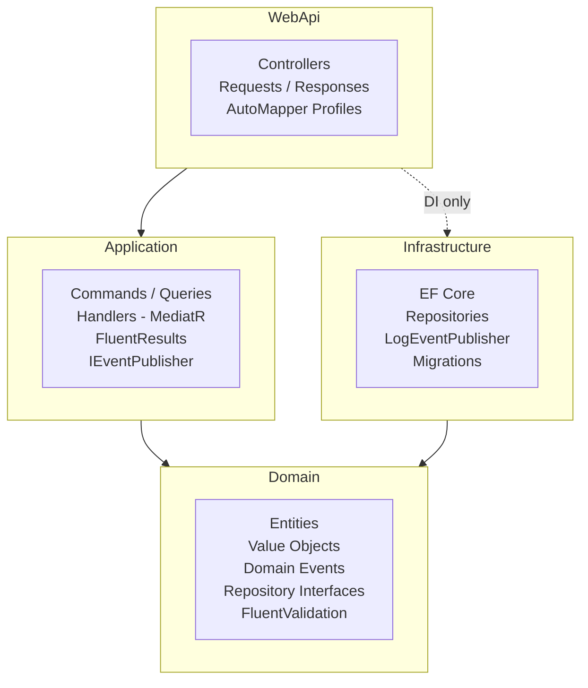

[Back to README](../README.md)

## Domain Documentation

### Aggregates & Entities

---

### External Identities Pattern

> Entities from other domains are referenced by **ID + denormalized name**, never as foreign keys with joined tables. This avoids cross-domain coupling and keeps each bounded context autonomous.

---

### Discount Business Rules

---

### Domain Events

---

### Architecture Layers

---

### Key Design Decisions

| Decision | Choice | Reason |
|---|---|---|
| Return type for domain ops | `Result<T>` (FluentResults) | Explicit failure without exceptions for expected business errors |
| Validation | FluentValidation on entities | Declarative, testable, reusable rules |
| Domain events dispatch | Collected in entity, published after persist | Ensures no events fire if save fails |
| Cross-domain references | External Identity (ID + Name) | Avoids coupling between bounded contexts |
| ORM access | Private setters + private constructor | EF Core reflects; domain controls mutations |
